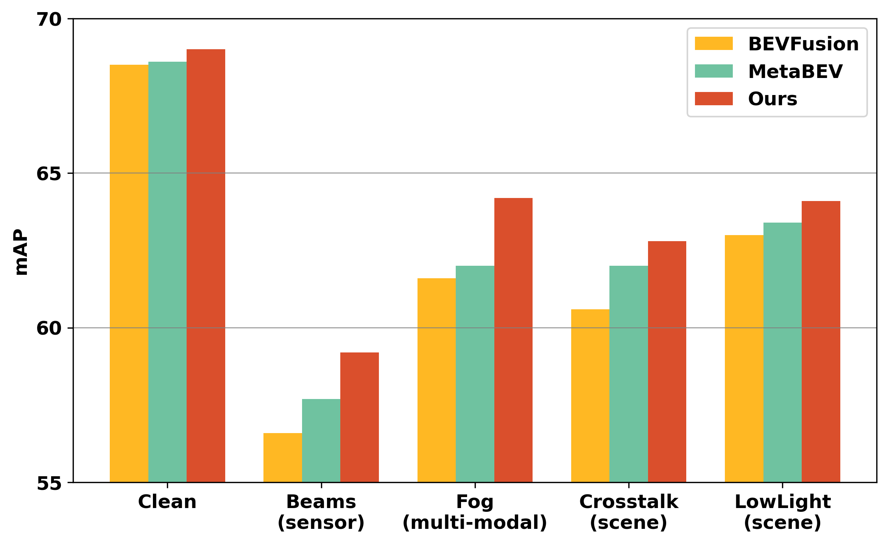

## Paper

Multi-Modal Decouple Network for Zero-Shot 3D Object Detection

## methods


## Results

Our model consistently outperforms SOTA models on all types of unknown data corruptions including sensor configurations and scene conditions of LiDAR, camera, and both. In addition, it maintains SOTA on clean data. 



## Requirments

- Python >= 3.8, \<3.9
- OpenMPI = 4.0.4 and mpi4py = 3.0.3 (Needed for torchpack)
- Pillow = 8.4.0 (see [here](https://github.com/mit-han-lab/bevfusion/issues/63))
- [PyTorch](https://github.com/pytorch/pytorch) >= 1.9, \<= 1.10.2
- [tqdm](https://github.com/tqdm/tqdm)
- [torchpack](https://github.com/mit-han-lab/torchpack)
- [mmcv](https://github.com/open-mmlab/mmcv) = 1.4.0
- [mmdetection](http://github.com/open-mmlab/mmdetection) = 2.20.0
- [nuscenes-dev-kit](https://github.com/nutonomy/nuscenes-devkit)

After installing these dependencies, please run this command to install the codebase:

```bash
python setup.py develop
```

## Data preparation

Please follow the instructions from [here](https://github.com/open-mmlab/mmdetection3d/blob/master/docs/en/datasets/nuscenes_det.md) to download and preprocess the nuScenes dataset. Please remember to download both detection dataset and the map extension (for BEV map segmentation). After data preparation, you will be able to see the following directory structure (as is indicated in mmdetection3d):

```
mmdetection3d
├── mmdet3d
├── tools
├── configs
├── data
│   ├── nuscenes
│   │   ├── maps
│   │   ├── samples
│   │   ├── sweeps
│   │   ├── v1.0-test
|   |   ├── v1.0-trainval
│   │   ├── nuscenes_database
│   │   ├── nuscenes_infos_train.pkl
│   │   ├── nuscenes_infos_val.pkl
│   │   ├── nuscenes_infos_test.pkl
│   │   ├── nuscenes_dbinfos_train.pkl

```

and run

```
python tools/create_data.py nuscenes --root-path ./data/nuscenes --out-dir ./data/nuscenes --extra-tag nuscenes
```

For Robo3D and RoboBEV, please download in [here](https://opendatalab.com/OpenDataLab/nuScenes-C/tree/main), and change the path in config


## Evaluation

### clean

```
torchpack dist-run -np 8 python tools/test.py [config file path] pretrained/[checkpoint name].pth --eval [evaluation type]
```

For example

```
torchpack dist-run -np 1 python tools/test.py configs/nuscenes/det/transfusion/secfpn/camera+lidar/swint_v0p075/multi_modal_decouple.yaml pretrained/multi_modal_decouple.pth --eval bbox
```

### corruptions

### scene and multi-modal corruptions

change "test scene corruption " in config and change types of corruptions

### sensor corruptions

Beams: change "reduce_beams" in config

FOV: change "point_cloud_angle_range" in config

Camera number : change "view_drop_nums" in config

## train

```
torchpack dist-run -np 8 python tools/train.py [config file path]
```

For example

```
torchpack dist-run -np 2 -v python tools/train.py configs/nuscenes/det/transfusion/secfpn/camera+lidar/swint_v0p075/multi_modal_decouple.yaml --model.encoders.camera.backbone.init_cfg.checkpoint pretrained/swint-nuimages-pretrained.pth --load_from pretrained/lidar-only-det.pth
```

## Acknowledgements

Our model is based on [mmdetection3d](https://github.com/open-mmlab/mmdetection3d). It is also greatly inspired by the following outstanding contributions to the open-source community:[BEVFusion](https://github.com/mit-han-lab/bevfusion), [Robo3D](https://github.com/ldkong1205/Robo3D),[RoboBEV](https://github.com/Daniel-xsy/RoboBEV), and [bevformer](https://github.com/fundamentalvision/BEVFormer).
